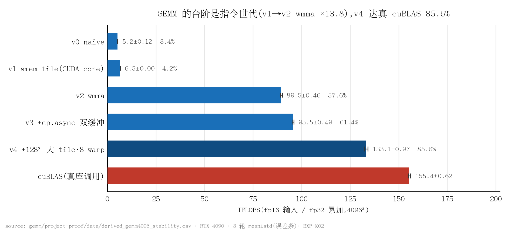
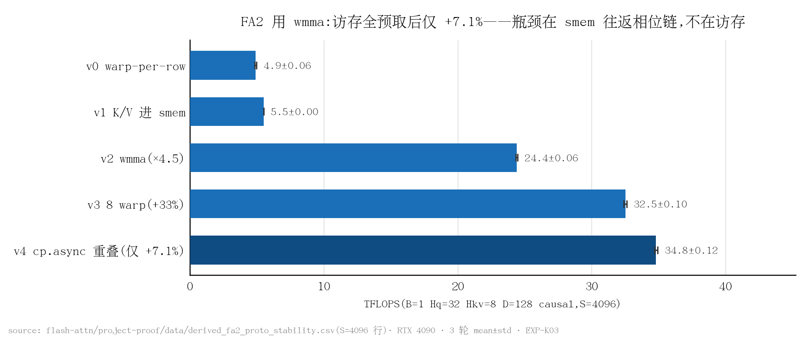
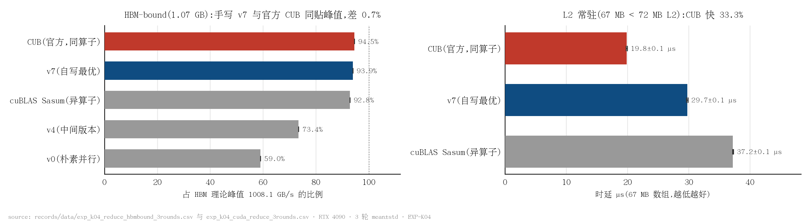
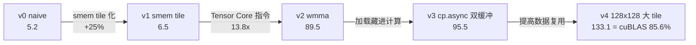

# Kernel_Optimazation

*手写 CUDA kernel 版本梯：十个算子，从 naive 到打平或反超通用库*

本项目考察手写 CUDA kernel 在什么条件下能赢过 cuBLAS / PyTorch，凭什么赢，又被哪一层机制限制。十个算子（reduce、softmax、gemv、int8 quantize、Tensor Core GEMM、FA2 forward，LLM 前向的三个融合逐元素算子 fused_add_rmsnorm、RoPE、silu_and_mul，以及完整的 W8A8 linear 链路）各自构成一条完整的优化版本梯：从 naive 实现逐级改进至打平或反超通用库，每一步提速可测量、可归因、可复现。测量显示，赢的三种形态（shape 特化、贴合硬件的极简结构、kernel 融合）与输的结构性原因（如 wmma 的架构税）都能落到具体机制上。方法论、逐项目拆解与跨项目规律见 [PORTFOLIO.md](PORTFOLIO.md)。

## 关于本仓

本仓是本项目的**公开展示版**，收录内容以可复现、可核验为限：

- **收录**：十个算子的 CUDA kernel 源码与版本梯、benchmark 原始数据（`*/project-proof/data/`、`records/data/` 下的 CSV）、性能图表、采集与绘图脚本、各算子 README 与 [PORTFOLIO.md](PORTFOLIO.md)。
- **未收录**：实验方法论文档、逐实验推导与记录、讲义与手写笔记、以及采集用的 `.ncu-rep` / `.nsys-rep` profiler 二进制原件。因此正文引用的「EXP-Kxx」为实验编号，其完整记录不随本仓提供；文中所有结论均可由本仓收录的数据与脚本复现或核验。

## 性能结果

测量均在 RTX 4090 上进行；凡未另注，数字为 3 轮 mean±std。

| 算子 | 结果 | 证据 |
|---|---|---|
| Tensor Core GEMM | **133.1±0.97 TFLOPS**，为真 cuBLAS 的 85.6%（4096³,fp16 输入 / fp32 累加；wmma + cp.async 双缓冲 + 128x128 tile；工具链 CUDA 13.2，12.8 下为 77.9%） | EXP-K02,`gemm/project-proof/data/derived_gemm4096_stability.csv` |
| FA2 forward | **34.8±0.12 TFLOPS**（S=4096，D=128，causal+GQA，全 shape 通过 2e-2 正确性 gate）；为同协议 Triton 版的 28%（跨 harness，推断级），即 wmma 架构税的定量测量 | EXP-K03，`flash-attn/project-proof/data/derived_fa2_proto_stability.csv` |
| reduce | HBM-bound 区间（1.07 GB）v7 达 HBM 理论峰值 **94.5%**(953.1 GB/s)，与官方 CUB 在测量分辨率内**贴平**（v7 反快 0.1%，与轮间 std 同量级）；L2 常驻区间（67 MB）CUB 快 **12.1%**；端到端 347.6 ms 至 0.291 ms，约 1193x（4070 Laptop 口径） | EXP-K04，`records/data/exp_k04_reduce_hbmbound_calfix_3rounds.csv`、`records/data/exp_k04_cuda_reduce_calfix_3rounds.csv` |
| softmax | 对齐 1024x1024 比 cuDNN 快 **6.7%**（0.007768 vs 0.008291 ms，3 轮）；非对齐 1024x1500 反被 cuDNN 快 9.9%—— 手写的形状敏感性代价。**两个数字都在工作集常驻 L2 的条件下取得**（1024x1024 fp32 = 8.4 MB，远小于 4090 的 72 MB L2；等效带宽 1080 GB/s 已超 DRAM 峰值）。**放大到 HBM-bound 规模后领先完全消失**——8192x4096（268 MB）实测两者持平（3 轮，294.2 对 294.3 us，双双贴在 912 GB/s = 峰值 90.5%）。手写的指令效率优势只有在数据供给不成瓶颈时才兑现成时间 | EXP-K04，`records/data/exp_k04_softmax_3rounds.csv` |
| gemv | v3 比真 `cublasSgemv` 快 **34.1%**（4096x2048 = 33.6 MB，3 轮；前一轮同协议 37.8%，差异来自 cuBLAS 侧轮间波动）。**该幅度只在工作集常驻 L2 时成立**——33.6 MB 放得进 4090 的 72 MB L2，等效带宽 2634 GB/s 已是 DRAM 峰值的 2.6 倍；强制冷读后两者同撞带宽墙（902 对 894 GB/s），差距收敛到 1.4% | EXP-K04、EXP-K09，`records/data/exp_k04_gemv_3rounds.csv` |
| int8 quantize | v4 **5.57±0.03 µs**(1024² per-channel symmetric)；单 kernel 融合较 PyTorch eager 快 6.6x（4070 Laptop 口径，单轮） | EXP-K01,`records/data/exp_k01_int8_quantize_3rounds.csv` |
| fused_add_rmsnorm | HBM 区间（1.0 GB）达 HBM 理论峰值 **91.4%**(921.3 GB/s)，相对 PyTorch eager **5.23x**，相对 torch.compile 与 Triton **打平**（差 0.1%）;L2 常驻区间（64 MB）**3669.0 GB/s**，相对 torch.compile **3.25x** | EXP-K05、EXP-K08，`fused-norm/project-proof/data/derived_fused-norm_vec-after_stability.csv` |
| RoPE | HBM 区间（336 MB）v4 达 **89.9%**(906.8 GB/s)，相对 PyTorch eager **5.10x**；L2 常驻区间 **3425.1 GB/s**；同一处「q/k 合并 launch」优化在 HBM 区间 -1.2%、在 decode 区间 **1.39x**，收益方向相反 | EXP-K05、EXP-K08，`rope/project-proof/data/derived_rope_vec-after_stability.csv` |
| silu_and_mul | HBM 区间（600 MB）v3 达 **92.1%**(928.3 GB/s)；融合一级实测 **1.680x**，与字节账预测的 5/3=1.667x 精确吻合；L2 区间相对 torch.compile **7.41x** | EXP-K05、EXP-K08，`activation/project-proof/data/derived_activation_vec-after_stability.csv` |
| W8A8 linear（完整链路） | prefill **2.167x** bf16 cuBLAS(T=2048/H=4096/O=12288)；decode 的 M=1 库路径不可用，自写 dp4a GEMV 在 HBM 区间 **1.972x**；同一份权重多做一次 `.contiguous()` 则整条链路变成 **0.726x**—— 3.6 倍差距全部来自 stride | EXP-K06，`w8a8/project-proof/data/derived_w8a8_vec-after_stability.csv` |



*图 1：GEMM 的性能台阶来自指令世代（v1 至 v2 换 wmma，13.8x），访存微调只是坡（v0 至 v1 仅 +25%）；v4 达真 cuBLAS 的 85.6%（CUDA 13.2；12.8 下为 77.9%）。（数据：`gemm/project-proof/data/derived_gemm4096_stability.csv`；脚本：`scripts/plot_readme_figures.py`）*



*图 2：同一套 wmma 工具箱，FA2 只到 34.8 TFLOPS；v4 把 K/V 访存全部预取重叠后仅 +7.1%，说明瓶颈在 shared memory 往返的相位链而非访存。（数据：`flash-attn/project-proof/data/derived_fa2_proto_stability.csv`；脚本：`scripts/plot_readme_figures.py`）*



*图 3：同一算子在两个区间的不同结局——HBM-bound 时手写 v7 与官方 CUB 同贴理论峰值（94.5% vs 94.4%，在测量分辨率内贴平），L2 常驻时 CUB 快 12.1%。（数据：`records/data/exp_k04_reduce_hbmbound_calfix_3rounds.csv`、`records/data/exp_k04_cuda_reduce_calfix_3rounds.csv`；脚本：`scripts/plot_readme_figures.py`）*

图表全部由脚本从原始数据生成（matplotlib）：`python scripts/plot_readme_figures.py`。

## 关键发现

**布局适配可以比任何一级 kernel 优化都值钱。** W8A8 链路上，同一份 int8 权重只是多做了一次 `.contiguous()`，INT8 GEMM 就从 2.74x bf16 掉到 0.756x，整条链路从 2.167x 变成 0.726x—— 3.6 倍的差距不涉及任何计算改动，全部来自 stride。 INT8 Tensor Core 要求 B 矩阵列主序，而 `F.linear` 里的 `w.t()` 天然就是列主序， 正确布局本来是免费的。这条与「赢的三种形态」并列：不改一行计算，只让数据以硬件想要的方式到达。（EXP-K06《W8A8 linear 完整链路》，`w8a8/project-proof/data/derived_w8a8_vec-after_stability.csv`）

**量化会把被测对象搬到另一个存储层级，从而破坏对比的前提。** int8 GEMV 在三个输出宽度下给出 4.43x / 8.69x / 1.972x 三个答案：O=12288 时 int8 权重 50 MB 落进 4090 的 72 MB L2、bf16 权重 101 MB 仍在 HBM—— 两条臂不在同一层级上比，8.69x 是无效数字。只有两边都超 L2 的那一档（1.972x）可外推，且此时两条臂分别贴到 94.4% / 93.1% 带宽峰值。这是 EXP-K04「测量效度先算账」在量化算子上的重演，而且更隐蔽：上次是忘了测 HBM 区间，这次是量化本身跨过了 L2 的边界。（EXP-K06《W8A8 linear 完整链路》，同一份 `w8a8/project-proof/data/derived_w8a8_vec-after_stability.csv` 的 decode 三档；峰值口径 1008 GB/s）

**贴上带宽墙之后，语言不再重要；分水岭是融不融合。** 三个访存主导的融合逐元素算子上， HBM 区间的手写 CUDA(906.8–928.3 GB/s)、Triton(898.9–927.8)与 torch.compile (877.5–925.9)统统落在 87–92% 峰值，同一算子内三者两两差距最大 3.3%（出在 rope 的 torch.compile 臂，另两个算子都在 0.3% 以内）；而未融合的 PyTorch eager 落后 1.7–5.2 倍。手写 CUDA 的价值只在两处仍然成立：L2 常驻区间（相对 torch.compile 快 3.25–7.41 倍）与 decode 的 launch 敏感区间（相对 Triton 快 2.49–4.86 倍）——而推理引擎恰好常驻这两个区间。配合 GEMM（手写够到真 cuBLAS 85.6%；CUDA 13.2，12.8 下为 77.9%）与 FA2（同一套 wmma 只够到自家 Triton 28%），「什么时候该用手写 CUDA」由此成为一条三点曲线：价值集中在需要 mma 级寄存器控制的场合。（本段三个逐元素算子的数字取自 `fused-norm/project-proof/data/derived_fused-norm_vec-after_stability.csv`、`rope/project-proof/data/derived_rope_vec-after_stability.csv`、`activation/project-proof/data/derived_activation_vec-after_stability.csv`：EXP-K05《LLM 融合逐元素算子三件套》、EXP-K08《BF16x8 向量化未兑现的定位与修复》；GEMM 的 85.6% 与 FA2 的 28% 另见 EXP-K02《CUDA Tensor Core GEMM 版本梯》与 EXP-K03《CUDA FA2 forward 简化版版本梯》）

**字节账要在 HBM 层面记，不能在指令层面记。** fused_add_rmsnorm 在 HBM 区间，按指令计数预测「寄存器缓存消掉第二遍重读」应有 +25%，实测 0%。性能计数器直接给出了原因：DRAM 读扇区恒为 **2.000×S** 的算法下界（两个输入张量各读一遍，实测 2.001×S），第二遍重读一个扇区都没落到显存；而 L1 命中率 **33.19%**、L2 读命中率仅 **0.20%**——**接住它的是 L1，不是 L2**（EXP-K09《向量化修复后的扇区账复采》§5.1）。被优化掉的是一次 L1 命中而非一次显存访问。静态字节账高估可优化空间的根源，是它把「发出一次 load 指令」等同于「搬一次显存」。该结论限 HBM 区间；L2 常驻区间带宽有余，同一改动的收益是另一回事。

**性能台阶来自指令世代，而非访存微调。** GEMM 版本梯上，smem tile 化（v0 至 v1）只带来 +25%，换用 Tensor Core 指令（v1 至 v2，wmma）一步 13.8x。compute-bound 算子里访存微调只是坡，指令世代才是台阶；反过来，memory-bound 的 reduce / gemv 里指令层面的微调收益趋近于 0。应先判定算子是 memory-bound 还是 compute-bound，再选优化手段——错配的优化在错误的方向上没有回报。

**wmma 的架构税：同一套工具箱，GEMM 够到 85.6%（CUDA 13.2；12.8 下为 77.9%），FA2 只够到 28%。** wmma accumulator fragment 的 lane 到元素的映射是编译器私有的，FA2 的行级 softmax(max/exp/rescale)无法直接在 fragment 上做——QK^T 结果必须 `store_matrix_sync` 落回 shared memory，再由标量段逐行重读，外加每个 tile 5 次 `__syncthreads` 的相位链。测量显示把 K/V 访存全部预取重叠后仅 +7.1%，说明瓶颈在这条相位链而非访存。越是依赖「融合免搬运」的算子，越需要 mma 级的寄存器控制——这正是官方 FA2 采用 CUTLASS/mma 而非 wmma 的定量理由。

**理论 occupancy 33% 为全梯最低，却是最快版本。** gemm v4 每线程 92 寄存器 x 256 线程 + 32KB smem，每 SM 只驻 2 个 block；但 4x2=8 个 accumulator fragment 常驻寄存器、一次 load 参与多次 `mma_sync`，Tensor Core 吞吐靠 fragment 级 ILP 与 smem 复用喂满，不靠线程数遮蔽延迟。occupancy 是手段，不是目标。

**指标与单轮数字都只是现象，结论依赖交叉验证。** int8 quantize v4 的 L2 命中率从 32% 跌至 2% 反而更快：char4 整字覆盖消除了逐字节 store 触发的 read-modify-write 补偿读，命中计数下降的同时实际访存量减少。gemv 曾单轮测得领先 84%，让对照物同样跑 3 轮后回落到 34%——领先幅度的一半来自 cuBLAS 侧的单轮波动。profiler 指标要配合时延趋势反推机制，领先幅度要配合对照物的方差才算数。

## 代码导览

GEMM 版本梯的五级结构与每级优化点如下（吞吐为 3 轮均值，TFLOPS，fp16 4096³，RTX 4090；EXP-K02《CUDA Tensor Core GEMM 版本梯》）：



**Tensor Core 主循环：wmma 4x2 fragment 与 cp.async 双缓冲**（摘自 [gemm/src/gemm_v4.cu](gemm/src/gemm_v4.cu) L40-L64；8 warp，每 warp 计算 64x32 输出）

```cuda
    for (int k0 = 0; k0 < K; k0 += BK) {
        if (k0 + BK < K)
            load_tile_async4(As[p ^ 1], Bs[p ^ 1], A, B, N, K,
                             bm, bn, k0 + BK, threadIdx.x, blockDim.x);   // 预取下一 tile
        __pipeline_wait_prior(k0 + BK < K ? 1 : 0);
        __syncthreads();
        #pragma unroll
        for (int kk = 0; kk < BK; kk += 16) {
            wmma::fragment<wmma::matrix_a, 16, 16, 16, half, wmma::row_major> af[4];
            wmma::fragment<wmma::matrix_b, 16, 16, 16, half, wmma::row_major> bf[2];
            #pragma unroll
            for (int i = 0; i < 4; ++i)
                wmma::load_matrix_sync(af[i], &As[p][wr * 64 + i * 16][kk], BK);
            #pragma unroll
            for (int j = 0; j < 2; ++j)
                wmma::load_matrix_sync(bf[j], &Bs[p][kk][wc * 32 + j * 16], BN);
            #pragma unroll
            for (int i = 0; i < 4; ++i)
                #pragma unroll
                for (int j = 0; j < 2; ++j)
                    wmma::mma_sync(acc[i][j], af[i], bf[j], acc[i][j]);
        }
        __syncthreads();
        p ^= 1;
    }
```

机制：shared memory 双缓冲 `As/Bs[2][…]`，mma 消费 buffer `p` 的同时 `cp.async` 向 `p^1` 预取下一 tile，加载完全藏进计算；4x2=8 个 accumulator fragment 常驻寄存器，一次 load 的 fragment 参与多次 `mma_sync`。正是这份 fragment 级 ILP 加 smem 复用，让理论 occupancy 33% 的 v4 成为全梯最快（EXP-K02 §6）。

**FA2 的 wmma 架构税：softmax 被迫经由 shared memory 往返**（摘自 [flash-attn/src/fa2_v2.cu](flash-attn/src/fa2_v2.cu) L72-L92）

```cuda
            wmma::store_matrix_sync(&Ssm[(warp * 16) * LDS + n * 16], sc,
                                    LDS, wmma::mem_row_major);   // S 从 fragment 倒回 smem
        }
        __syncthreads();
        if (tid < BM) {                                // 行级在线 softmax
            const int row = q0 + tid;
            const int jend = min(BN, (causal ? row + 1 : S) - n0);
            float rmax = -1e30f;
            for (int j = 0; j < jend; ++j)
                rmax = fmaxf(rmax, Ssm[tid * LDS + j] * scale);
            const float mn = fmaxf(m_s[tid], rmax);
            const float alpha = __expf(m_s[tid] - mn);
            float sum = 0.f;
            for (int j = 0; j < BN; ++j) {
                float p = j < jend ? __expf(Ssm[tid * LDS + j] * scale - mn) : 0.f;
                Psm[tid * LDP + j] = __float2half(p);
                sum += p;
            }
            l_s[tid] = l_s[tid] * alpha + sum;
            m_s[tid] = mn; a_s[tid] = alpha;
        }
```

机制：wmma accumulator fragment 的 lane 到元素的映射是编译器私有的，行级 max/exp/rescale 无法在 fragment 上做——QK^T 结果必须 `store_matrix_sync` 落 shared memory，再由标量段逐行重读。这一往返加上每 tile 5 次 `__syncthreads` 的相位链，把 FA2「融合免搬运」的优势吃掉大半：GEMM 用 wmma 够到 cuBLAS 的 85.6%（CUDA 13.2；12.8 下为 77.9%），FA2 只够到自家 Triton 版（mma + 寄存器驻留）的 28%（跨 harness）。这就是官方 FA2 采用 CUTLASS/mma 而非 wmma 的定量理由（EXP-K03《CUDA FA2 forward 简化版版本梯》§6）。

## 快速开始

```bash
# 单项目(以 gemm 为例;flash-attn 同构,bench 二进制为 fa2_bench)
cd gemm
cmake -S . -B build -DCMAKE_BUILD_TYPE=Release && cmake --build build -j
BENCH_OUT=project-proof/data/$(date -u +%Y%m%dT%H%M)_gemm4096_r1.csv ./build/gemm_bench

# softmax / gemv / int8-quantize 一键 bench 加出图
bash scripts/run_bench_and_plot_all.sh

# 3 轮 stability 复测(结果以带时间戳前缀的新文件落盘,不覆盖历史数据)
bash scripts/stability_rebench.sh

# NCU 全项目采集
bash scripts/run_ncu_all.sh
```

环境细节（GPU / CUDA / driver 与依赖）见各子项目 README；各子项目自带 `project-proof/data/`（数字的原始出处）与 README。

## 实验记录摘要

每个实验的结论摘要如下（完整实验记录与推导讲义未随本仓公开；下表中的 `records/data/*.csv` 为原始数据）：

| 记录 | 结论 |
|---|---|
| EXP-K01 四 kernel 4090 重基准:roofline 迁移(4070 Laptop → 4090) | 四 kernel(reduce / softmax / gemv / int8)RTX 4090 重基准，确立 3 轮 mean±std 与对照物验真两条协议：gemv 单轮 84% 复测不成立；softmax 的对照库对比因对照物系自写 kernel 整体撤销；reduce / gemv 的对照口径其后由 EXP-K04 取代。 |
| EXP-K02 CUDA Tensor Core GEMM 版本梯(v0→v4,vs 真 cuBLAS) | Tensor Core GEMM 版本梯 v0 至 v4：性能台阶来自指令世代（v1 至 v2 为 13.8x），v4 133.1 TFLOPS = 真 cuBLAS 的 85.6%（CUDA 13.2；12.8 下为 77.9%），理论 occupancy 33% 最低却最快。 |
| EXP-K03 CUDA FA2 forward 简化版版本梯(v0→v4,量化 wmma 架构税) | CUDA FA2 版本梯 v0 至 v4：同一套 wmma 工具箱只到 34.8 TFLOPS（同协议 Triton 版的 28%，跨 harness）——架构税量化，瓶颈在 shared memory 往返的相位链。 |
| EXP-K04 标准库基准补齐与两区间重测(CUB / cuDNN 入场) | 补齐同算子官方基准（CUB / cuDNN）并分 L2 常驻与 HBM-bound 两区间重测：HBM-bound 时 reduce v7 达 HBM 理论带宽 94.5%、与 CUB 贴平（v7 反快 0.1%），L2 常驻时 CUB 快 12.1%；softmax 对齐形状快 cuDNN 6.7%、非对齐慢 9.9%；gemv v3 快 `cublasSgemv` 34.1%。 |
| EXP-K05 LLM 融合逐元素算子三件套:fused_add_rmsnorm / rope / silu_and_mul | LLM 融合逐元素算子三件套（fused_add_rmsnorm / RoPE / silu_and_mul）版本梯，并首次把手写 CUDA、Triton、PyTorch eager、torch.compile 四类臂放进同一个 harness 受测：HBM 区间三种实现两两差最大 3.3%，L2 与 decode 区间手写领先 3.25–7.41x 与 2.49–4.86x（这三项按 EXP-K08 向量化修复后的复采口径更新，EXP-K05 当轮口径为两两差 <2%、领先 3.2–10.6x 与 2.5–11x）；七条跑前锁定的预测中四条成立、两条被数据推翻。 |
| EXP-K06 W8A8 linear 完整链路：per-token 量化 + INT8 GEMM/GEMV + 融合反量化 | W8A8 linear 完整链路（per-token 量化 + INT8 GEMM + 融合反量化 + decode 用的 dp4a GEMV）：prefill 2.167x、decode HBM 区间 1.972x；三步分解显示量化只占 1.7%、反量化占 26.7%；权重布局值 3.6 倍；M>16 是库路径的硬约束。 |
| EXP-K07 采集主机 NCU 计数器闭环：分管线利用率、GEMM 对照口径核验、fused-norm L2 命题转实测 | 在一台计数器可用的 RTX 4090 上补齐六个 C++ 算子的计数器采集：wmma 的 Tensor 管线利用率由编译期证据升为运行时实测（v1 0% → v2 25.71%）；gemm v4 与 cuBLAS 的性能比 77.9%（该机 CUDA 12.8；主力机 13.2 下为 85.6%）与两者 Tensor 管线利用率之比77.7% 吻合；fused-norm「第二次读不出片」证实（DRAM 读恒为算法下界 2.000×，向量化修复前 L1 命中率 83%；修复后复采见 EXP-K09）；补采 CUB 同算子对照。 |
| EXP-K08 BF16x8 向量化未兑现的定位与修复：从 alignas 到 union | 三个逐元素算子声称的 16 B 向量化在 SASS 层从未兑现——`alignas(16)` 只保证地址对齐、不强制向量化访存。修复 fused-norm 后 L2 常驻区间v3 +21.3%、v4 +41.8%（同环境 A/B，未改动的 v1/v2 对照组 +0.1%）；v4 由慢于 v3 反转为快于 v3。 |
| EXP-K09 向量化修复后的扇区账复采：守卫验证与「浪费比」判据 | 向量化兑现后复采扇区账:L1TEX 请求精确降为原来的 1/4(16→4、12→3 ×S,正好等于 16 B/4 B),而 DRAM 读纹丝不动停在 2.000×S 的算法下界——可知修复前那版「向量化」在兑现之前是负优化,只是被 L1 全部吸收才在 DRAM 侧看不出来;并由 L1TEX/DRAM 浪费比给出「向量化有没有收益」的单向必要条件。 |
| EXP-K10 gemm/fa2 v5 = mma PTX + ldmatrix + smem padding | 用 `mma.sync.m16n8k16` PTX + `ldmatrix` 重写 gemm 与 FA2 的 v4 微内核并消除 smem bank conflict:两者正确性全 PASS,性能均与 v4 持平(gemm 135.1±2.08 对 132.8±0.49 TFLOPS,差值仅 1.1 倍合并 std;FA2 35.0 对 34.8 TFLOPS)。「smem swizzle 能消除该瓶颈」这条推断由此在两个算子上同时被证伪——冲突波前占比高不等于它是性能瓶颈。 |

## 测量方法

- **每个数字可溯源**：基准结果只以带时间戳前缀的新文件落盘，首行记录环境 / 代码版本 / 完整命令 / GPU / driver，不覆盖历史数据；本文与图表中的每个数字都能指回原始数据文件。
- **关键结论不少于 3 轮**：进入本文的对比数字均为 3 轮 mean±std 并在图中带误差条；对照物同样跑 3 轮——自家 kernel 稳定不代表对照稳定，单轮领先幅度里可能有一半来自对照的坏轮。
- **对照物验真**：凡标注 cuBLAS 的对照都经源码调用点核查、确系真实库调用；自写参照一律命名 handwritten_*，PyTorch 对照标明 eager/API 口径。
- **设对照臂与反例臂**：归因不靠「一路加速」的单调叙事，而靠故意构造的退化版本——softmax 的 v4.2 / v4.3 / v4.4 三个反例把加速拆解到具体机制（warp shuffle / 负载均衡 / bank conflict）。
- **负结果与被证伪的假设照常报告**：gemv 单轮曾测得领先 84%，3 轮复测显示一半以上来自 cuBLAS 侧单轮波动，现行口径 34.1%；softmax 曾有的对照库对比因对照物经源码核查系自写 kernel 而整体撤销，改以 cuDNN 重做；reduce 曾以 `cublasSasum`(Σ|x|)作对照且测在 L2 常驻尺寸上，该口径整体撤销，改以同算子 CUB 分两区间重测；跨 harness 对比（vs Triton / sdpa）一律标注推断级，不与同 harness 实测混谈。
- **profiler 隔离**：NCU / nsys 环境下测得的时延不进入 benchmark 表。

## 相关项目

- [vllmExperience](https://github.com/lyell0710/vllmExperience)— vLLM 推理服务实验证据仓（2x4090）
- [llm-engine](https://github.com/lyell0710/llm-engine)— 手写 Llama2 推理引擎
- triton-kernels（未公开）— Triton 版 GEMM / FA2，本仓「跨 harness 对照」数字的口径出处
