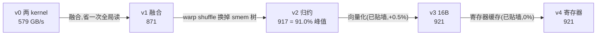

# fused_add_rmsnorm

*把 pre-norm Transformer 每层出现两次的「残差加 + RMSNorm」压成一个 kernel*

`residual += x; out = rmsnorm(residual) * w`。两个输出都要：`residual` 是下一层的残差流，`out` 是本层分支的归一化输入。这是 LLM 前向里调用次数第二多的访存型算子。

本算子完全是 memory-bound：每元素只有几次乘加，却要搬 8 字节。优化的唯一杠杆是减少每元素的全局访存字节数，五级版本梯就是这条字节账的下降史。

## 性能结果

RTX 4090，bf16,3 轮 mean±std（数据：`project-proof/data/derived_fused-norm_vec-after_stability.csv`）。有效带宽按**算法下界字节数**（读 x + 读 residual + 写 residual + 写 out = 8 B/元素）计，因此超过 100% 峰值即说明数据落在 L2。

| 版本 | 改动 | HBM 区间（T=32768， H=4096，工作集 1.0 GB） | L2 区间（T=2048，工作集 64 MB） |
|---|---|---|---|
| v0 | 未融合，两个 kernel | 579.4±0.1 GB/s (57.5%) | 1251.9 GB/s |
| v1 | 融合成单 kernel | 871.3±0.1 GB/s (86.4%) | 1565.7 GB/s |
| v2 | warp shuffle 归约 | 917.1±0.1 GB/s (91.0%) | 2347.2 GB/s |
| v3 | 16 B 向量化访存 | 921.3±0.1 GB/s (91.4%) | 3619.4 GB/s |
| v4 | 寄存器缓存消第二次读 | 920.8±0.3 GB/s (91.3%) | **3669.0 GB/s** |
| PyTorch eager | — | 176.2±0.1 GB/s (17.5%) | 409.5 GB/s |
| torch.compile | — | 920.1±0.4 GB/s (91.3%) | 1127.5 GB/s |
| Triton | — | 922.4±0.2 GB/s (91.5%) | 1747.9 GB/s |

HBM 区间手写 v3 相对 PyTorch eager **5.23x**，相对 torch.compile 与 Triton 均**打平**（差 0.1%）；L2 区间手写 v4 相对 torch.compile **3.25x**。

## 关键发现

**v3 与 v4 的零收益，是本梯最有信息量的一格。** 静态字节账预测向量化是最大台阶、寄存器缓存再给 +25%，实测两者合计 +0.4%。原因可以从测量本身反推：v2 的有效带宽按 4 次访存计得 917 GB/s；若第二遍重读真的走到 HBM（5 次访存），实际带宽将是 917×10/8 = 1146 GB/s，**超过 1008 的物理峰值，不可能**。所以这次重读从一开始就被缓存接住，从未到过显存。计数器进一步把「哪一层接住的」钉死：v4 的 L1 命中率 33.19%、L2 读命中率仅 0.20%，而 DRAM 读扇区纹丝不动停在 2.000×S 的算法下界（residual 与 x 各读一遍），第二遍重读一个扇区都没多要——接住它的是 L1，不是 L2（EXP-K09《向量化修复后的扇区账复采》§5.1，../records/EXP-K09_post_vectorization_sector_ledger.md）。v4 消掉的是一次 L1 命中，不是一次显存访问。 **字节账要在 HBM 层面记，不能在指令层面记。**

**三种实现在带宽墙前收敛。** 手写 CUDA 921.3、Triton 922.4、torch.compile 920.1 GB/s， 两两差距 <0.25%。而未融合的 eager 落后 5.2 倍。分水岭是「融不融合」，不是「用什么写」。

## 代码导览



融合的核心是这一段：加法结果 `s` 在写回显存的同时，顺手在寄存器里累加平方和， 平方和不再需要单独读一遍（摘自 [src/fused_norm_v1.cu](src/fused_norm_v1.cu)）：

```cuda
    for (int i = threadIdx.x; i < H; i += blockDim.x) {
        float s = __bfloat162float(res[i]) + __bfloat162float(xr[i]);
        res[i] = __float2bfloat16(s);   // 立刻写回:下一层要拿它当残差
        acc += s * s;                   // 累加的是 fp32 的 s,不是回读值
    }
```

- 归约原语（warp shuffle 两级）见 [include/fused_norm.h](include/fused_norm.h)
- 向量化（16 B / 线程）见 [src/fused_norm_v3.cu](src/fused_norm_v3.cu)
- 寄存器缓存与它为什么必须用模板常量下标，见 [src/fused_norm_v4.cu](src/fused_norm_v4.cu)
- 七条臂共用的单一 harness 见 [bench.py](bench.py) 与 [../scripts/bench_common.py](../scripts/bench_common.py)

## 快速开始

```bash
export CUDA_HOME=/usr/local/cuda
python bench.py                                  # 默认写 project-proof/data/
BENCH_OUT=project-proof/data/run_r1.csv python bench.py   # 指定输出
```

首次运行会 JIT 编译 CUDA 扩展（约 60-90 秒），之后走增量缓存。 Triton 对照臂可选，由 `TRITON_KERNELS_SRC` 指定姊妹仓路径，找不到则静默跳过。

## 测量方法

- 五个手写版本经 `torch.utils.cpp_extension` 绑进 torch，与 PyTorch eager / torch.compile / Triton 共用同一段 CUDA-event 计时，跨实现比较为同 harness 实测。
- 每形状 10 轮 warmup 后，一对 event 包住整段循环再除以次数（逐次计 event 的 ~1 us 开销会成为被测量本身）。
- 正确性：与 PyTorch 参考实现比对，分母取参考输出的全局 absmax；v4 与 v3 额外做逐位相等断言，确保寄存器缓存未改变语义。
- 编译不开 `--use_fast_math`：本算子访存主导，快速数学无性能价值却会让舍入偏离 PyTorch，给数值差异引入无法归因的来源。
