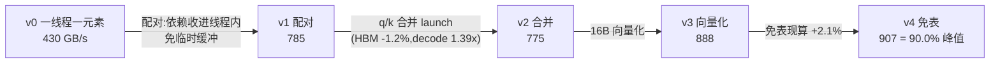

# RoPE(旋转位置编码)

*把「读配对元素 + 查表 + 旋转」压成一次向量化就地更新*

把 head_dim 的前后两半 $(x_1, x_2)$ 视作 $D/2$ 个复数的实部与虚部，整体乘以 $e^{i\theta_{pos}}$。cos/sin 表的前后两半是重复的同一组频率，这是本算子能把访存砍半的结构前提。

命名陷阱：vLLM 把这种「前后半段」布局叫 `is_neox=true`，GPT-J 式的「奇偶交错」叫 `is_neox=false`；HF 的 llama/Qwen 用的是前后半段。两种布局互换不报错、不 NaN， 只让模型输出变成乱码。

## 性能结果

RTX 4090，bf16，Qwen3-8B 的 GQA 布局（HQ=32， HK=8， head_dim=128），3 轮 mean±std。有效带宽按算法下界（q/k 各读一次写一次 = 4 B/元素）计，超 100% 即数据落在 L2。本页数字统一取自 [project-proof/data/derived_rope_vec-after_stability.csv](project-proof/data/derived_rope_vec-after_stability.csv)（EXP-K05《LLM 融合逐元素算子三件套》、EXP-K08《BF16x8 向量化未兑现的定位与修复》）。

| 版本 | 改动 | HBM（T=32768，工作集 336 MB） | L2(T=2048,21 MB) | decode(T=1) |
|---|---|---|---|---|
| v0 | 一线程一元素，q/k 分离 | 430.0±0.2 GB/s (42.7%) | 732.4 GB/s | 19.53 us |
| v1 | 一线程一对，读 2 写 2 | 784.7±1.5 GB/s (77.8%) | 2025.6 GB/s | 11.22 us |
| v2 | q/k 合并进一次 launch | 775.0±1.5 GB/s (76.9%) | 2092.1 GB/s | 8.06 us |
| v3 | 16 B 向量化 | 887.8±0.2 GB/s (88.1%) | 3405.5 GB/s | 8.02 us |
| v4 | 免表，`__sincosf` 现算 | **906.8±0.3 GB/s (89.9%)** | **3425.1 GB/s** | **7.92 us** |
| PyTorch eager | — | 177.7±0.1 GB/s (17.6%) | 284.6 GB/s | 136.74 us |
| torch.compile | — | 877.5±0.2 GB/s (87.0%) | 562.8 GB/s | 81.55 us |
| Triton | — | 898.9±0.6 GB/s (89.2%) | 1117.7 GB/s | 38.47 us |

HBM 区间手写 v4 相对 PyTorch eager **5.10x**，相对 Triton 与 torch.compile 分别 +0.9% / +3.3%；L2 区间相对 torch.compile **6.09x**。

## 关键发现

**同一个改动在两个区间收益差 32 倍。** v1→v2（q/k 合并 launch）在 HBM 区间是 -1.2%（差值 9.7 GB/s 约为轮间 std 的 6.5 倍，是真实的小幅回退而非噪声），在 decode 区间是 1.39x。带宽饱和时省一次 launch 毫无意义； T=1 时一次 launch 就能主导总时间。优化必须绑定工作区间来谈。

**免表只赢 2.1%，而这个"只"正是结论。** 用算力换访存在 memory-bound 算子上通常是对的，但 cos/sin 两张表在 head_dim=128、T=32768 时合计不到 17 MB（单表 8.4 MB），整份常驻 4090 的 72 MB L2——查表根本没走到显存。省掉的是 L2 命中，不是 HBM 访问。

**一线程一元素 + 就地更新 = 读写冲突。** 前半的线程要读 `t[g+half]`、后半的线程要读 `t[g-half]`，互为对方的输入，而两者又都要写自己；不同 block 之间没有执行顺序保证。这类 bug 不崩不 NaN，只是结果悄悄错一半，且随调度顺序随机变化。v0 的解法是先把整份输入拷到临时缓冲（多一次全量读写）；v1 让同一个线程持有一对元素后，依赖被收进线程内部，冲突自然消失——这才是 v0→v1 提速 1.83x 的主因，不只是"少读一次 cos"。

## 代码导览



配对处理的核心（摘自 [src/rope_v1.cu](src/rope_v1.cu)）：

```cuda
        const float x1 = __bfloat162float(t[base]);
        const float x2 = __bfloat162float(t[base + half]);
        // 复数乘法 (x1 + i*x2) * (c + i*s) 的实部与虚部;
        // 两个输出都算完再写,写的顺序无关紧要——依赖已被收进寄存器
        t[base]        = __float2bfloat16(x1 * c - x2 * s);
        t[base + half] = __float2bfloat16(x2 * c + x1 * s);
```

- 就地更新的读写冲突与保守解法见 [src/rope_v0.cu](src/rope_v0.cu)
- 向量化（16 B / 线程，要求 `D % 16 == 0`）见 [src/rope_v3.cu](src/rope_v3.cu)
- 免表现算与它的参数规约边界见 [src/rope_v4.cu](src/rope_v4.cu)

## 快速开始

```bash
export CUDA_HOME=/usr/local/cuda
python bench.py
```

## 测量方法

同 [../fused-norm/README.md](../fused-norm/README.md) 的「测量方法」节：五个手写版本绑进 torch，与 PyTorch / torch.compile / Triton 共用一段 CUDA-event 计时。

就地算子的 bench 有一处特别容易翻车：**clone 必须在计时闭包之外**。正确性需要干净副本，时延不需要；把 clone 写进被计时的函数里会让该臂每次迭代白搬一遍整个张量，表现为"恰好慢 2 倍"这种整数倍关系——那是 harness bug 的指纹，不是性能现象。
