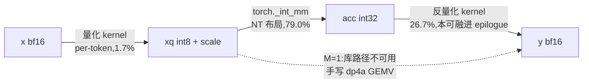

# W8A8 linear

*权重 int8（离线 per-channel）+ 激活 int8（在线 per-token）的完整链路*

```
① 量化   x[T,H] bf16  ->  xq int8 + x_scale[T] fp32     (per-token 动态)
② GEMM   acc[T,O] int32 = xq @ wq^T                     (INT8 Tensor Core)
③ 反量化 y[t,o] = acc[t,o] * x_scale[t] * w_scale[o]     -> bf16
```

**只做 ① 是负收益。** 把量化算子插进推理路径但后面仍走 bf16 GEMM，等于量化完立刻反量化，只多了两次显存往返。W8A8 的收益全部来自 ②，所以本项目测的是整条链路， 而不是任何单独一步。

## 性能结果

RTX 4090,3 轮 mean±std。INT8 GEMM 用 `torch._int_mm`(cuBLASLt IMMA)； 量化、反量化、decode 用的 GEMV 是手写 kernel。本页数字统一取自 [project-proof/data/derived_w8a8_vec-after_stability.csv](project-proof/data/derived_w8a8_vec-after_stability.csv)（EXP-K06《W8A8 linear 完整链路》、EXP-K08《BF16x8 向量化未兑现的定位与修复》）。

### prefill:完整链路 vs bf16 cuBLAS

| 形状（H=4096） | bf16 cuBLAS | W8A8 | 加速 | W8A8（权重行主序） |
|---|---|---|---|---|
| T=512, O=4096 | 0.10953±0.00008 ms | 0.05716±0.00012 ms | **1.916x** | 0.13994 ms(0.783x) |
| T=512, O=12288 | 0.34189±0.00086 ms | 0.17534±0.00107 ms | **1.950x** | 0.44524 ms(0.768x) |
| T=2048, O=12288 | 1.31949±0.00200 ms | 0.60875±0.00013 ms | **2.167x** | 1.81626 ms(0.726x) |
| T=8192, O=12288 | 5.20636±0.01344 ms | 2.46936±0.00166 ms | **2.109x** | 7.36857 ms(0.706x) |

三步分解（T=2048/O=12288）：量化 **1.7%**、INT8 GEMM 79.0%、反量化 **26.7%**。

### decode(T=1):库路径不可用,自写 int8 GEMV

`torch._int_mm` 在 M=1 时报 `self.size(0) needs to be greater than 16`—— 这是硬约束， 不是性能问题。

| 形状 | bf16 cuBLAS GEMV | int8 GEMV | 加速 | 存储层级 |
|---|---|---|---|---|
| O=4096(int8 17 MB / bf16 34 MB) | 0.03839 ms | 0.00866 ms | 4.43x | 两边都在 L2 |
| O=12288(int8 50 MB / bf16 101 MB) | 0.10734 ms | 0.01235 ms | 8.69x | **对比无效**（见下） |
| O=32768(int8 134 MB / bf16 268 MB) | 0.28204 ms | 0.14302±0.00008 ms | **1.972x** | 两边都在 HBM |

**唯一可外推的是 1.972x。** HBM 区间两条臂的等效权重带宽分别为 951.8 与 938.5 GB/s（94.4% / 93.1% 峰值）—— 都贴在带宽墙上，2 倍完全来自权重字节减半。

## 关键发现

**权重布局的影响比任何一级 kernel 优化都大。** 同一份 int8 权重，只是多做了一次 `.contiguous()`，整条链路从 **2.167x 变成 0.726x**；单看 GEMM 是 2.74x 变 0.756x， **3.6 倍的差距全部来自 stride**。

INT8 Tensor Core 要求 B 矩阵列主序（NT 布局）。而 `F.linear(x, w)` 算的是 `x @ w.T`，`w` 是 `[O,H]` 行主序，`w.t()` 天然就是 `[H,O]` 列主序—— **正确布局是免费的，前提是别在中间"顺手整理"一下**。`.contiguous()` 在别处通常无害，在这里是 3.0 倍的性能损失。

**量化把被测对象搬到了另一个存储层级，对比的前提被量化本身破坏。** O=12288 时，int8 权重 50 MB 落在 4090 的 72 MB L2，而 bf16 权重 101 MB 落在 HBM——两条臂根本不在同一个存储层级上比，8.69x 是一个无效数字。这个陷阱是量化特有的： 砍半的动作恰好可能跨过 L2 的边界。判定加速比之前必须先算两边各自的工作集。

**反量化占整条链路 26.7%，而它本可以完全消失。** 如果由 GEMM kernel 在结果还留在寄存器/共享内存里时就地完成，这一遍 int32 读 + bf16 写就不存在。用 cuBLASLt 的现成接口拿不到那个位置——这是生产框架（如 vLLM 的 CUTLASS W8A8）要自己写 GEMM 的主要理由之一，本项目把它量化成了一个具体数字。

**量化步只占 1.7%。** 这是对"你的 int8 量化算子性能怎么样"这个问题最直接的回答： 问错了对象。单独优化它对 W8A8 的端到端几乎没有影响。

## 代码导览



per-token 量化的核心是行内求 absmax 再逐元素缩放，结构与 RMSNorm 同型（摘自 [src/quant_per_token.cu](src/quant_per_token.cu)）：

```cuda
    float m = 0.f;
    for (int i = threadIdx.x; i < H; i += blockDim.x)
        m = fmaxf(m, fabsf(__bfloat162float(row[i])));
    const float s = fmaxf(block_reduce_max(m, smem), 1e-12f) / 127.0f;
```

- 舍入用 `rintf` 而非 `truncf`，否则量化误差的均值不为 0、逐层累积成 logits 偏移； 饱和到 `[-127,127]` 而非 `[-128,127]`，理由见 [include/w8a8.h](include/w8a8.h)
- decode 用的 `__dp4a` 整数点积 GEMV 见 [src/int8_gemv.cu](src/int8_gemv.cu)； 激活 scale 必须以**设备指针**传入，用主机标量会在每次调用插入一次隐式同步
- 反量化的向量化版与"为什么它不该单独存在"见 [src/dequant.cu](src/dequant.cu)

## 快速开始

```bash
export CUDA_HOME=/usr/local/cuda
python bench.py
```

## 测量方法

- 手写 kernel 经 `torch.utils.cpp_extension` 绑进 torch，与 `torch._int_mm`、 `F.linear` 共用同一段 CUDA-event 计时。
- 三步各自单独计时，用于定位下一步该优化哪儿；**分解之和与总时间对不上， 就是存在多余搬运的信号**（实现过程中据此查出一次多余的 `copy_`）。
- 每个形状都标注两条臂各自的权重工作集与所处存储层级（L2 / HBM）， 跨层级的对比一律标记为无效。
